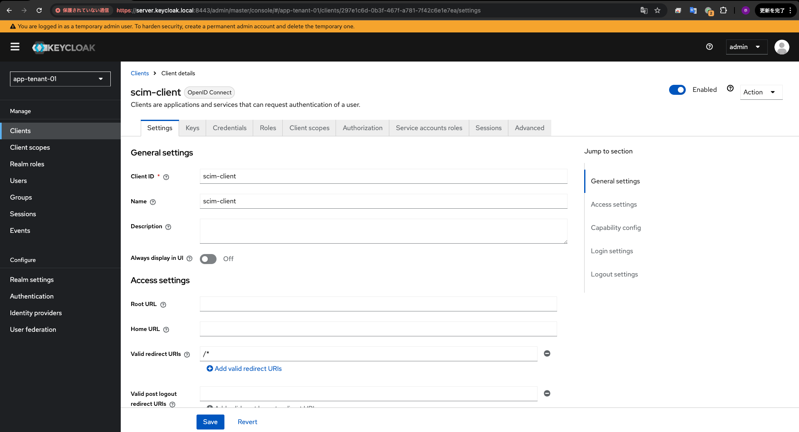
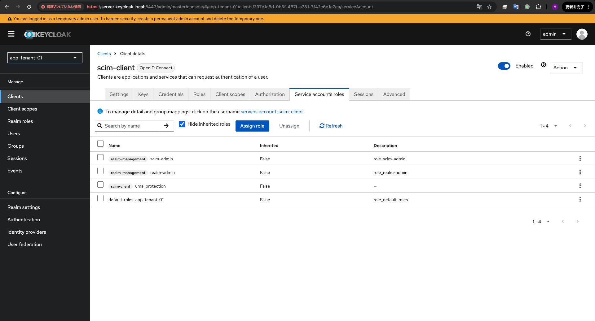
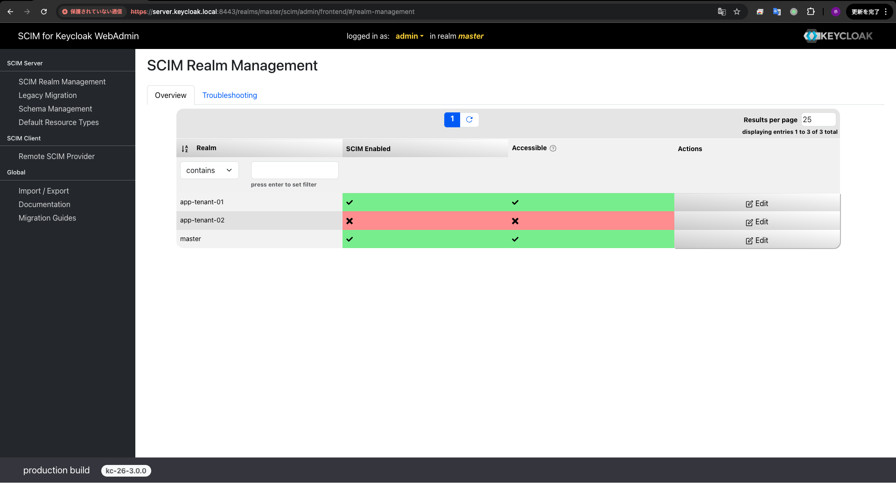
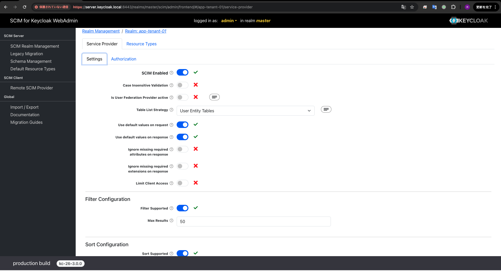
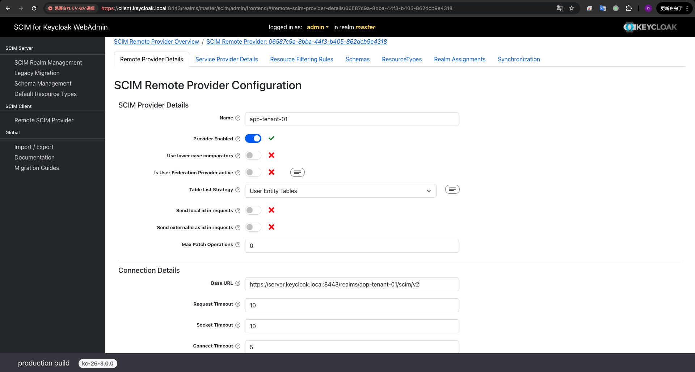
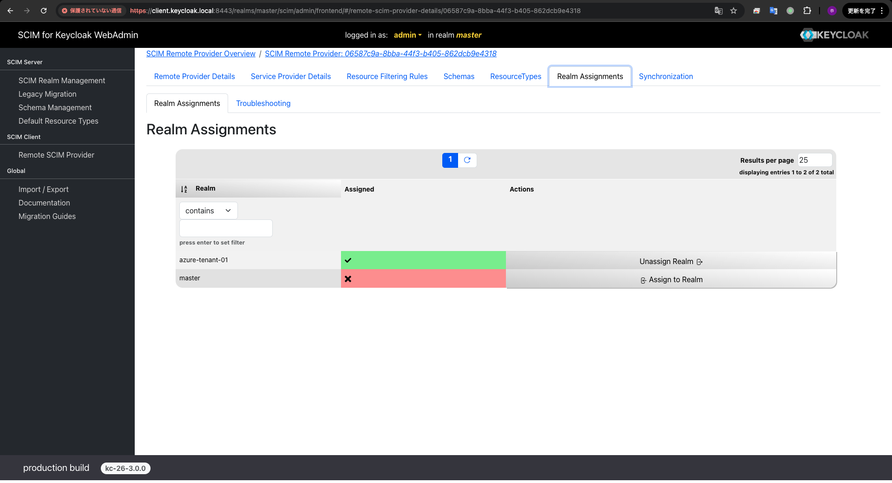
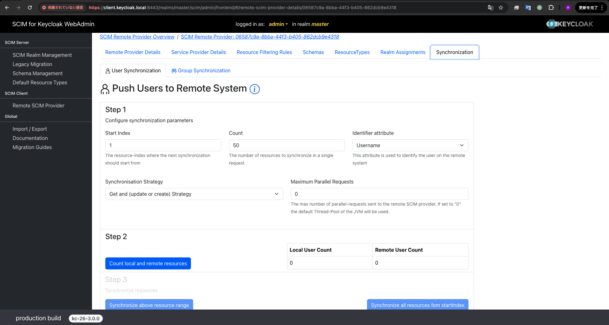

# Keycloak にて SCIM を検証する

[https://scim-for-keycloak.de/](https://scim-for-keycloak.de/)を利用する

## Install

1. [https://scim-for-keycloak.de/](https://scim-for-keycloak.de/)にアカウントを作成し, Free Trial を利用する.
2. Free 版の Jar ファイルとライセンスファイルをダウンロードする.
3. [./server](./server) に Jar ファイルとライセンスファイルを配置する.
4. コンテナをビルド, 起動する.
   ```bash
   docker-compose up -d
   ```

以下でアクセスできる.
| URL | 説明 |
| --- | --- |
| [https://server.keycloak.local:8443](https://server.keycloak.local:8443) | SCIM Server |
| [https://client.keycloak.local:8443](https://client.keycloak.local:8443) | SCIM Client |

## Configuration

### SCIM Server

#### Create Client for SCIM

1. ユーザを連携したい Realm に`scim-client`というクライアントを作成する.
2. `scim-client`の`Client authentication`を有効にする.
   
3. `scim-admin`, `realm-admin`の ClientRole を`scim-client`に追加する.
   

#### Enable SCIM

1. `SCIM Administration Console`にアクセスする.
2. `master`Realm を選択して`admin`ユーザでログインする.
   `admin`ユーザでなくても良い, ただし`admin`権限が必要.
   
3. `Edit`から`SCIM`を有効にする.
   

#### Set Remote SCIM Provider

1. [https://client.keycloak.local:8443](https://client.keycloak.local:8443)にアクセスする.
2. `Remote SCIM Provider` に移動する.
3. 以下の設定で`Remote SCIM Provider`を設定する.
   | 設定 | 値 |
   | ------------------- | ------------------------------------------------------------------------------------------------------------------------------------------------------------------------------ |
   | Base URL | https://server.keycloak.local:8443/realms/app-tenant-01/scim/v2 |
   | Authentication Type | OAuth2 Client Credentials Grant |
   | Token Endpoint | https://server.keycloak.local:8443/realms/app-tenant-01/protocol/openid-connect/token |
   | Client ID | `scim-client` に設定した ClientID |
   | Client Secret | `scim-client` に設定した ClientSecret |

    

4. 同期元のユーザが所属する Realm を Assign する.
   
5. `Synchronization`タブで手動で同期を実行できる.
   
